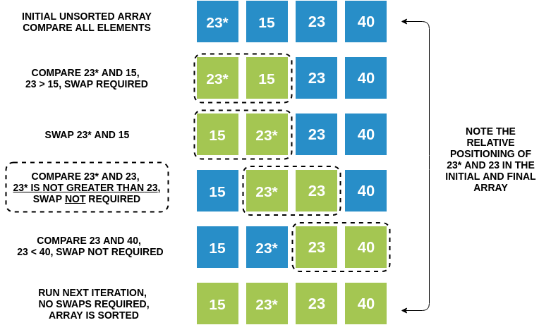

### What is a Stable Sort Algorithm?

A sorting algorithm is said to be stable if two objects with equal keys appear in the same order in sorted output as they appeared in the input unsorted array. For example, look at the picture below. The unsorted array has two elements with value 23. Note the order of both these elements in the stable and unstable sorted arrays.

### Stable and Unstable Sort

### Is Bubble Sort Stable?

Yes, Bubble Sort is a stable sorting algorithm. We swap elements only when A is less than B. If A is equal to B, we do not swap them, hence relative order between equal elements will be maintained.
Look at the picture below and keep an eye out for the ordering of 23 and 23*. Note how the original order of these elements is retained throughout the sorting process. The relative positioning of 23 and 23* does not change in the sorted output.

### Stability of Bubble Sort

