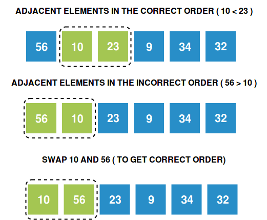

### Demonstration of Bubble Sort Concept

<iframe src="https://www.youtube.com/embed/ph-C6sUyzE4" frameborder="0" allow="autoplay; encrypted-media" allowfullscreen></iframe>

### How can we sort an array?

In Bubble Sort, we take the simplest possible approach to sort an array.

- We look through the array in an orderly fashion, comparing only adjacent elements at a time.
- Whenever we see two elements which are out of order (refer to the picture below), we swap them so that the smaller element comes before the greater element.
- We keep performing the above steps over the array again and again till we get the sorted form.

### When should we swap?

### Important Observations

Let's take note of a few important observations :

- If we start from the first index and keep comparing the ith and (i+1)th element (where i varies from 1th to the second last index), at the end of one iteration, we see that the greatest element in the entire array has reached the last position.
- This is because no matter where the greatest element was, it gets swapped repeatedly to reach it's correct position. Refer to the picture below!
- Similarly, if we do a second iteration, we will end up with the second greatest element in the second last position.

### Step by Step Process for One Iteration

