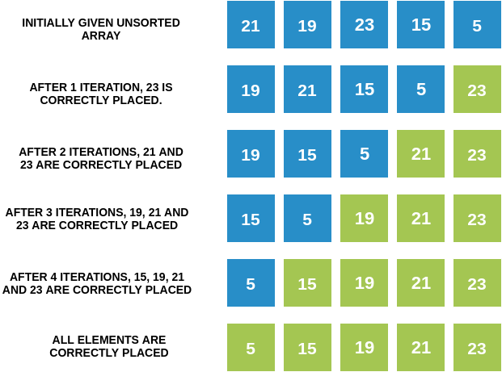

### Algorithm of Bubble Sort
Let's have a final look at the consolidated algorithm to sort an array of N elements:

  - **STEP 1** : Compare the ith and (i+1)th element, where i=first index to i=second last index.

  - **STEP 2** : Compare the pair of adjacent elements. If ith element is greater than the (i+1)th element, swap them.

  - **STEP 3** : Run steps 1 and 2 a total of N-1 times to attain the final sorted array.

### Demonstration of Bubble Sort Algorithm
<iframe src="https://www.youtube.com/embed/aFjElrUB0Qw" frameborder="0" allow="autoplay; encrypted-media" allowfullscreen></iframe>

### Iteration by Iteration Visualization of Bubble Sort

### Observations

From the above observations, we can conclude that after the Tth iteration, we will have the Tth largest element placed at its correct position. If we have N elements in a given array, we would therefore have to run N-1 iterations to place all the elements in their correct place and completely sort the array.

Notice that after N-1 iterations, N-1 elements will be in their correct positions, so the one element left will automatically have no choice but to already be in its correct position as well!

Look at the picture below and work out the result of each iteration. See if it matches the picture, and notice which elements keep getting placed correctly after each iteration! 
